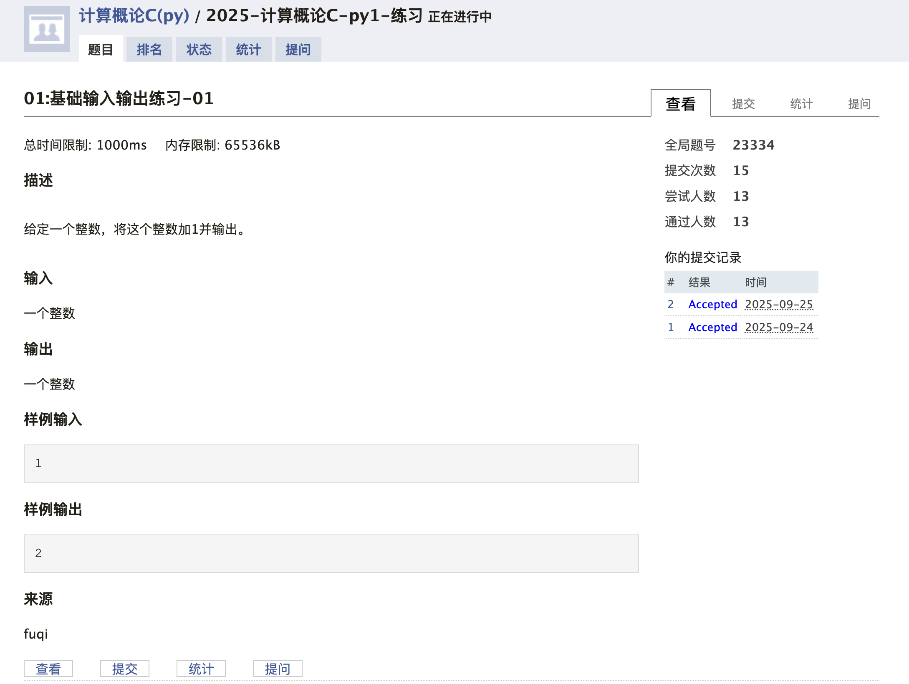
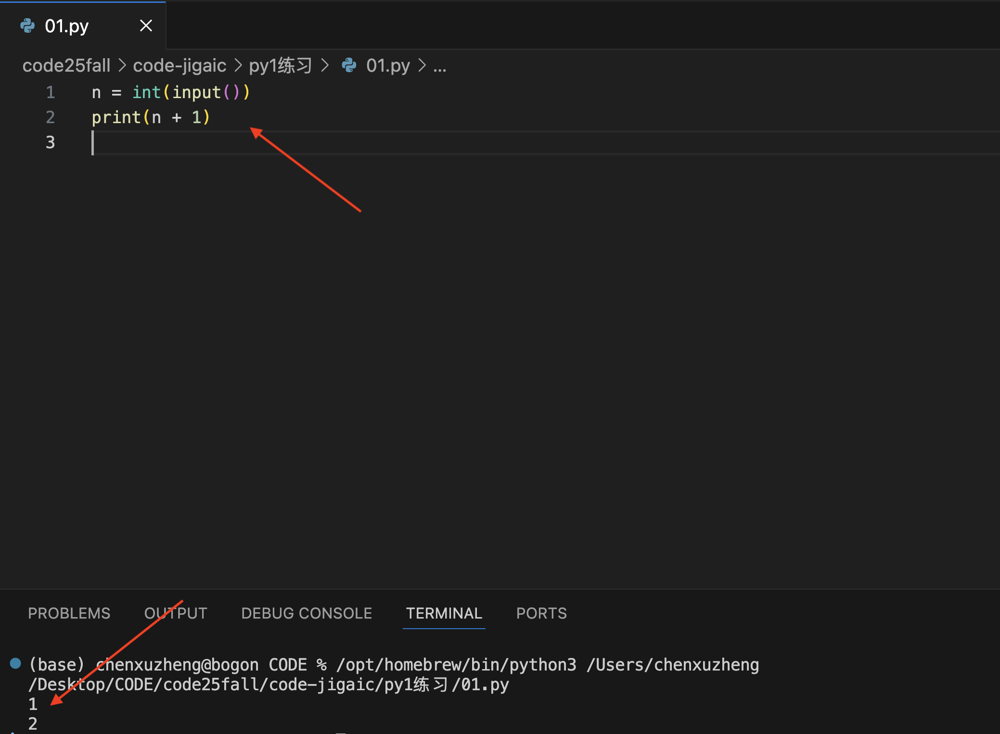
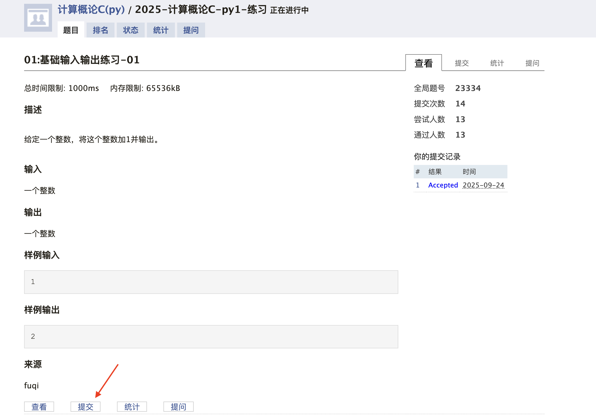
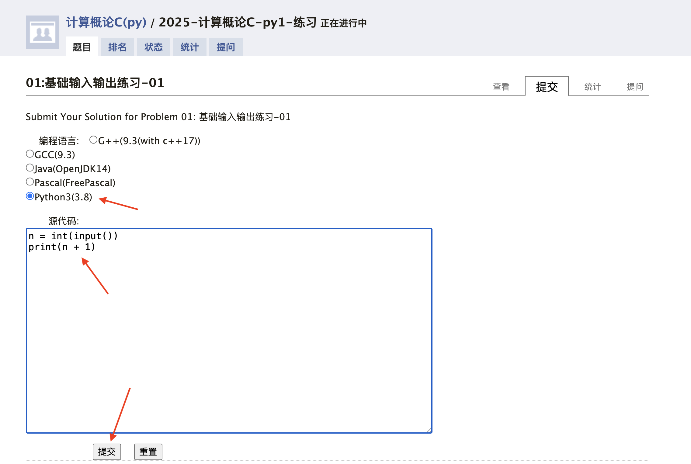
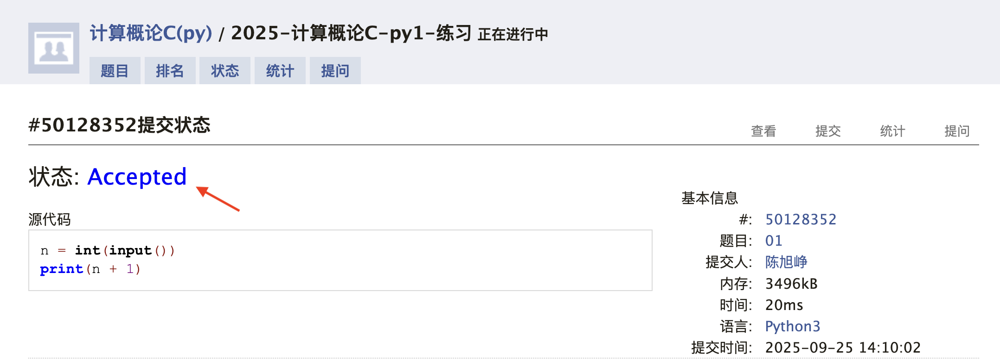

## 如何写一个Python程序
### 程序的基本编写方法
所有程序都可以抽象为 **输入 - 处理 - 输出** 三步：

- **Input**：获取输入数据，通常通过`input()`函数接收输入
- **Process**：处理数据，通过各种操作将输入数据转换为要输出的结果
- **Output**：输出结果，通常通过`print()`函数输出结果

比如在第一次上机课我们给出的`03:数字的2倍`这道题目：

**题目描述**  
输入一个数字，计算它的2倍并输出。

**输入**  
一个整数a。

**输出**  
整数a的2倍：2a。

**样例输入**
```
4
```

**样例输出**
```
8
```
我们的代码就可以按照如下的逻辑来写：
```python lines 03:数字的2倍 icon="Python"
a = int(input())                   # Input步骤，将输入的整数读进来，转换成整型并放进变量a中
b = 2 * a                          # Process步骤，将a乘以2，结果放进变量b中
print(b)                           # Output步骤，将结果b输出
```

### Python 程序文件
我们明白了代码该如何写，那代码应该写在哪里呢？Python 的代码通常写在以 `.py` 结尾的 Python 文件中，比如我们上面写的代码就可以写成 `03.py` 文件，文件内容如下：
```python
a = int(input())
b = 2 * a
print(b)
```
写完后，我们就可以在IDE中直接点击右上角的 ▶️ 来运行代码。


### 注释写法
在写代码的过程中，有时候我们会需要写注释，可能是帮助其他同学看懂你的代码，也可能是为了让你在两个月后再看到这段代码时快速理解它的功能。注释不会被 Python 执行，主要是起到辅助作用。

注释主要分三种写法：
- 行尾注释：直接在某行代码后面用 `#` 加上注释内容，比如：
```python highlight={1}
a = int(input())  # 将输入的整数读进来，转换成整型并放进变量a中
```
- 单行注释：在代码前用 `#` 加上注释内容，比如：
```python highlight={1}
# 将输入的整数读进来，转换成整型并放进变量a中
a = int(input())
```
- 多行注释：用三个引号 `"""` 包围注释内容，比如：
```python highlight={1-3}
"""
将输入的整数读进来，转换成整型并放进变量a中
"""
a = int(input())
```
注释的内容不会被Python解释器执行，所以不会影响代码的运行，但注释的内容可以帮助你理解代码的功能，所以写注释是一个好习惯。

我们可以灵活运用三种注释，来让你的代码变得更加可读，比如：
```python
"""
计算一个数字的2倍
输入：一个整数a
输出：整数a的2倍：2a
"""
# 将输入的整数读进来，进行处理后再输出
a = int(input())  
b = 2 * a         # 将a乘以2，结果放进变量b中
print(b)          
```


## 课堂内容回顾

### 输入函数

#### 1. `input()` 基本用法
- **功能**：从控制台读取用户输入，**返回值为字符串**。
- **语法**：
  ```
  变量 = input("提示信息")
  ```

#### 2. 类型转换
由于 `input()` 返回的是字符串，**必须手动转换**为其他类型才能参与运算。而转换成什么类型，取决于你下面需要用什么样的数据进行运算：

| 类型 | 转换函数 | 示例 |
|------|----------|------|
| 整数 | `int()`  | `x = int(input())` |
| 浮点数 | `float()` | `y = float(input())` |
| 字符串 | 无需转换 | `s = input()` |

#### 3. 单行输入多个值
使用 `split()` 分割字符串，再分别转换：
**输入**
```
10 20 30
```
**对应代码**
```python
a, b, c = map(int, input().split())
```
这时，`a`、`b`、`c` 分别为 `10`、`20`、`30`。

#### 4. 多行输入
如果有很多行输入，那么有几行就要有几个 `input()`：
**输入**
```
2
3
```
**对应代码**
```python
a = int(input())
b = int(input())
```
这时，`a` 为 `2`，`b` 为 `3`。

#### 5. 常见问题
- **OJ 平台**不要加提示信息！
- **类型错误**：忘记转换直接运算会出现错误。


### 输出函数

#### 1. `print()` 基本用法
```python
print("Hello, World!")
```

#### 2. 参数详解
| 参数 | 作用 | 默认值 | 示例 |
|------|------|--------|------|
| `sep` | 分隔符 | 空格 `' '` | `print(1, 2, 3, sep=',')` → `1,2,3` |
| `end` | 结尾符 | 换行 `'\n'` | `print("Hi", end='')` → 不换行 |

#### 3. 字符串格式化
- **f-string（推荐）**：
```python
name = "Alice"
age = 20
print(f"My name is {name}, age is {age}")
```
输出结果为：
```
My name is Alice, age is 20
```

- **format()**：
```python
print("Pi = {:.2f}".format(3.14159))
```
输出结果为： 
```
Pi = 3.14
```


### 模块

#### 1. 导入方式
| 方式 | 语法 | 调用方法 | 备注 |
|------|------|----------|------|
| 导入整个模块 | `import math` | `math.pi` | 推荐，避免命名冲突 |
| 导入并起别名 | `import numpy as np` | `np.array()` | 简化书写 |
| 导入特定函数 | `from math import sqrt` | `sqrt(2)` | 慎用，易重名 |
| 导入全部 | `from math import *` | `pi` | 不推荐，污染命名空间 |

#### 2. 常用内置模块

① 数学运算
| 模块/内置函数 | 功能示例 | 常用成员 |
|---------------|----------|----------|
| `math` | 数学常量与高等函数 | `math.pi` `math.e` `math.sqrt()` `math.sin()` `math.log()` |
| 内置数值函数 | 最常用，无需导入 | `abs(-5)` `max(1, 7, 3)` `min([4, 2, 9])` `pow(2, 10)` `round(3.1415, 2)` `divmod(17, 5)` |

② 类型转换
| 模块/内置函数 | 功能示例 | 常用成员 |
|---------------|----------|----------|
| 内置类型函数 | 字符串↔数字↔布尔 | `int("123")` `float("3.14")` `str(100)` `bool(1)` `list(range(3))` `tuple([1,2])` |

③ 随机与日期
| 模块 | 功能示例 | 常用成员 |
|------|----------|----------|
| `random` | 随机数、随机取样 | `random.randint(1, 6)` `random.choice(['A','B','C'])` `random.shuffle(lst)` |
| `datetime` | 当前时间、时间差 | `datetime.datetime.now()` `datetime.timedelta(days=7)` |

④ 文件/系统
| 模块 | 功能示例 | 常用成员 |
|------|----------|----------|
| `os` | 路径/文件/目录 | `os.path.join('dir','file.txt')` `os.listdir('.')` `os.makedirs('new_dir')` |
| `sys` | 命令行参数与标准流 | `sys.argv` `sys.stdin` `sys.exit(0)` |


#### 3. 使用示例
```python lines icon="Python" highlight={1,3}
import math
r = float(input())
area = math.pi * r ** 2
print(f"Area = {area:.2f}")
```


## OpenJudge的使用

我们以 [计算概论C(py)/2025-计算概论C-py1-练习/01:基础输入输出练习-01](http://jgcq.openjudge.cn/2025jgchw1lx1/01/)为例，展示如何在OpenJudge进行提交。
<Steps>
  <Step title="读题">
      
  </Step>
  <Step title="本地写代码并测试">
    
    - 你需要在本地打开自己安装的IDE（如PyCharm或VSCode），新建Python文件，按照题目要求写好代码。
    - 写完代码后，你最好在本地运行进行测试，确保代码正确，测试的时候可以选择题目所给的`样例输入`和`样例输出`。
    <Note>
    写代码时尽量在本地IDE里面写，而非在OpenJudge的“源代码”框中写。在本地IDE中写代码可以方便测试与调试，在后续学到更多内容（如循环、函数等）时，IDE的缩进、高亮也能够给你带来便利。
    </Note>
  </Step>
  <Step title="点击“提交”按钮并复制本地代码至“源代码”框内">
  首先，点击`提交`按钮：
  
  你会进入一个新的页面。接下来你需要进行三个步骤：
  - 选择编程语言：一般来说提交的时候编程语言默认都为 `Python3(3.8)`。如果不是，请切换到这一编程语言。
  - 复制本地代码：复制你在本地写的本题的代码，然后粘贴在 `源代码`下方的框中。
  - 点击`提交`。
  

  </Step>
  <Step title="提交并查看结果">
  提交后，等待片刻后刷新网页，如果题目的状态变为 `Accepted`，则说明你的代码通过了后台的测试，你这道题目就顺利完成了。
  
  如果题目的状态不是 `Accepted`，则说明你的代码写的有问题，并没有通过后台的测试，你需要回到本地IDE，修改代码，然后重新提交。  
  如果显示其他内容，一般是由以下原因引起：
  1. `Wrong Answer`：程序错误，导致结果错，结果不能全部符合测试样例。
      - 应多编一些输入数据进行测试，或检查程序中是否有逻辑错误。
  2. `Runtime Error`：运行时出错。
  原因很多：
      - 如变量没有定义就使用
      - 下标越界
      - 类型转换不合理（最常见的原因是试图将非数值形式的字符串转成整数）
      - 字符串与数值相加
      - 输入数据结束，还执行input()（例如输入数据只有2行，程序却执行了3次input()）
      - 不能比较大小的数据进行比较（例如字符串与证书比较大小）
      - 除法或求余数运算的除数是0
  3. `Compile Error`： 编译错。
      - 主要由语法错误引起。
  4. `Presentation Error`：格式错（几乎对了）。
      - 主要是结果中的空格、回车与测试样例不符。			
  5. `Time Limit Exceeded`： 运行超时，即程序运行时间超过了允许的时间。
      - 原因：有死循环，或算法不好，导致运行太慢。
  6. `Output Limit Exceeded`： 死循环导致不停输出。

  </Step>
</Steps>


---
<div className="text-center text-xs text-gray-400 mt-10">
  贡献者：陈旭峥  
  上次修改：2025/09/25
</div>
---