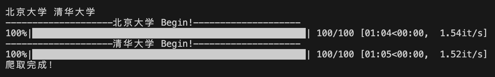
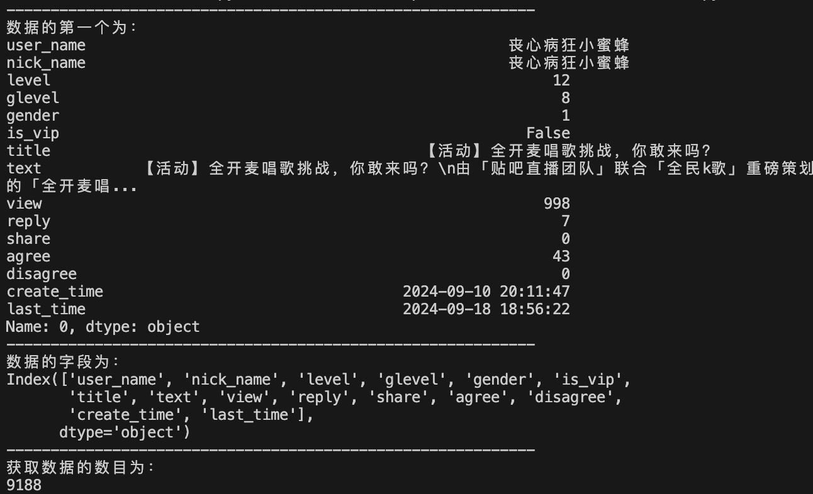
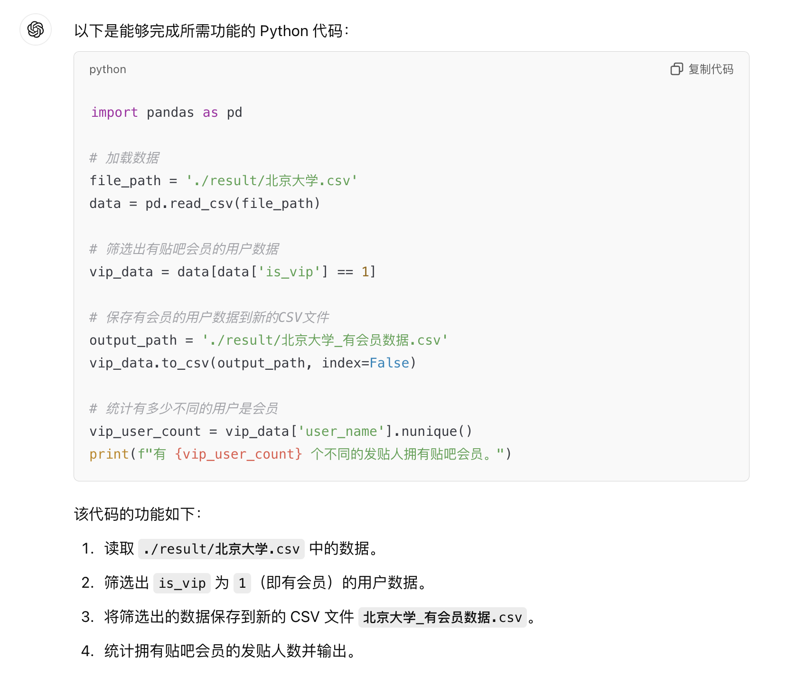
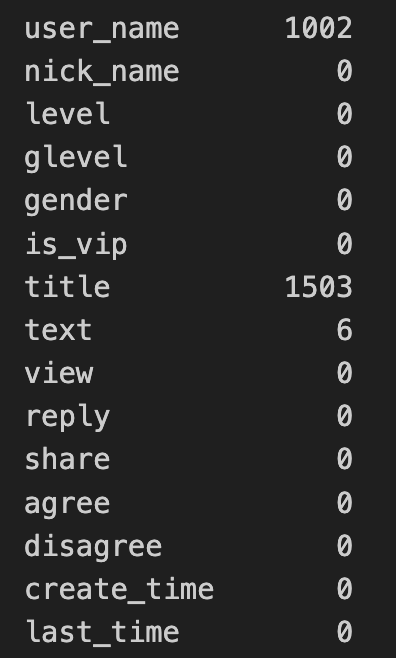
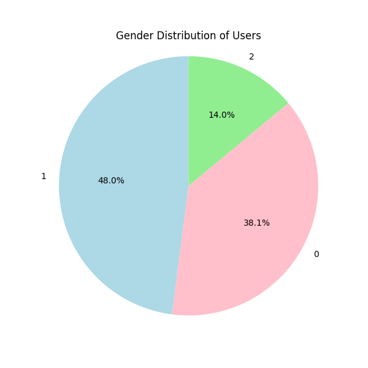
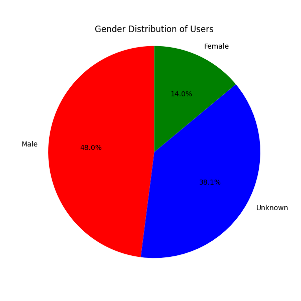
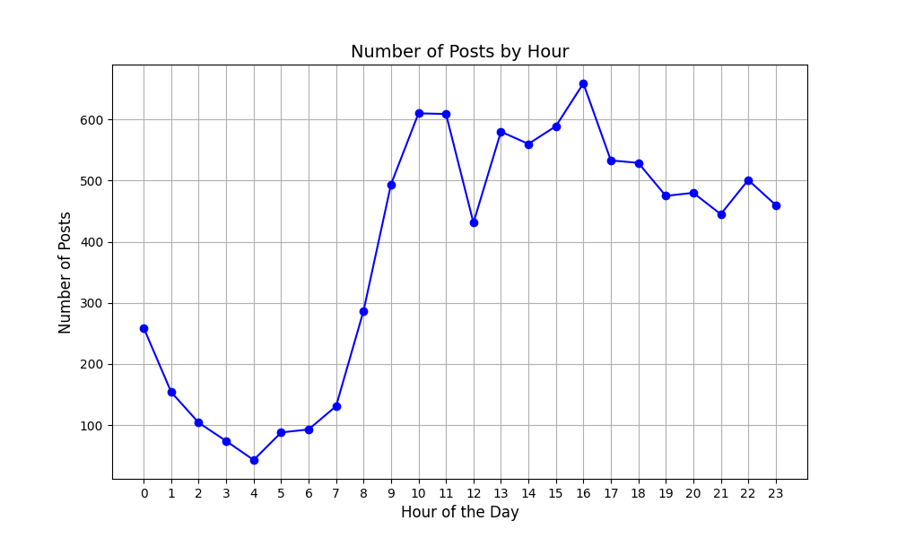
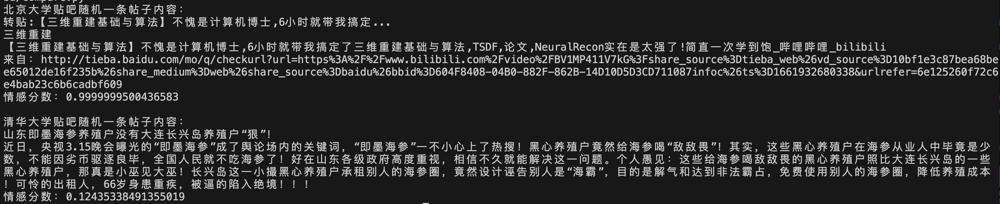

<Info>
省流版：在大语言模型的辅助下，针对百度贴吧等进行数据分析。
</Info>
## 1 前言
数据分析是指用适当的统计分析方法对收集来的大量数据进行分析，将它们加以汇总和理解并消化，以求最大化地开发数据的功能，发挥数据的作用。无论是哪个学科，都会有各式各样的数据，也都会存在数据分析相关的工作和应用。随着 Python 的广泛应用，Python 在数据分析中也得到越来越多的使用。Python 的便捷性以及其所提供的数据分析及可视化的包，能够成为你进行数据分析的有力工具。

**在本项大作业中，我们希望你能够结合生成式人工智能和 Python 代码，来完成对于百度贴吧等数据的数据分析任务**。

<Tip>
如果你对 Python 以及相关的数据分析基础较为熟悉，可以**跳过 Python 基础部分**，直接查看<span className="text-blue-500">**大作业的要求及注意事项**</span>。
</Tip>

## 2 Python 基础

在这一章节，我们为你列出了**在数据分析的过程中可能会用到的一些Python包：Numpy、Pandas、Matplotlib、Seaborn**。希望你在这一章节的内容中，不仅能够掌握这几个包的相关使用，还能够对 Python 包的安装流程有更进一步的了解。

### 2.1 相关包的安装
在使用如上述 Numpy 等 Python 包之前，你要先经过两个步骤——安装包和导入包：
1. 安装包  
   我们推荐你使用 [pip](https://pypi.org/project/pip/) 进行包的安装。pip 是一个非常好用的 Python 包管理工具，在安装好 pip 后，只需要在命令行中通过
   ```bash
   pip install xxx(包的名字)
   ```
   就可以安装你所需要的包，如
   ```bash
   pip install numpy
   ```
   除此之外，你还可以指定安装包的版本，或者修改pip源进行加速等（参考<span className="text-blue-500">附录A Pip</span>）。

2. 导入包  
   在包安装好之后，并不能够在 Python 文件中直接使用，而是要通过导入包之后才可以。你可以在特定的 Python 文件的开头加入
   ```python
   import xxx(包的名字)
   ```
   来导入包，如
   ```python
   import numpy
   ```
   你也可以为这个包指定一个简单的名字，如
   ```python
   import numpy as np
   ```
   在导入包后续的代码中，你就可以正常地使用这个包。
### 2.2 Numpy

[Numpy（Numerical Python）](https://numpy.org) 是 Python 的一种开源的数值计算扩展。这种工具可用来存储和处理大型矩阵，比 Python 自身的嵌套列表（nested list structure）结构要高效的多（该结构也可以用来表示矩阵），支持大量的维度数组与矩阵运算，此外也针对数组运算提供大量的数学函数库。

### 2.3 Pandas

[Pandas](https://pandas.pydata.org) 是基于 Numpy 的一种工具，该工具是为解决数据分析任务而创建的。Pandas 纳入了大量库和一些标准的数据模型，提供了高效地操作大型数据集所需的工具。Pandas 提供了大量能使我们快速便捷地处理数据的函数和方法。你很快就会发现，它是使 Python 成为强大而高效的数据分析环境的重要因素之一。

### 2.4 Matplotlib

[Matplotlib](https://matplotlib.org) 是一个 Python 的 2D 绘图库，它以各种硬拷贝格式和跨平台的交互式环境生成出版质量级别的图形。通过 Matplotlib，开发者可以仅需要几行代码，便可以生成直方图、条形图、散点图等。

### 2.5 Seaborn

[Seaborn](https://seaborn.pydata.org) 是 Python 中的一个可视化库，是对 Matplotlib 进行二次封装而成。绘图接口更为集成，可通过少量参数设置实现大量封装绘图，多数图表具有统计学含义，例如分布、关系、统计、回归等，且风格设置更为多样，例如风格、绘图环境和颜色配置等。

上面的链接可以供大家提前了解或者学习更多包的相关用法。Pandas 和 Matplotlib 等包都会在我们的课程中涉及到，只用这两个包就可以完成许多基本的数据分析。总的来说，我们希望你使用上课所学过的知识（如Pandas、Matplotlib，可能也可以用到 [Jieba](https://github.com/fxsjy/jieba) 等来生成词云）来对于某些数据进行分析。

## 3 大作业要求

### 3.1 基本要求

在这项大作业中，我们希望你能够收集百度贴吧数据并进行分析，最后形成一份简单的报告，大致可以包括以下的几部分：

1. **选题背景**（必做）  
   介绍选题的背景信息，即为什么想选择这一类数据进行研究，可能包括选择这类数据有什么意义或者研究价值等。
2. **数据获取及介绍**（必做）  
   介绍数据集的相关情况，比如相关字段、数据集大小等，百度贴吧数据获取可以通过<span className="text-blue-500">附录B aiotieba包</span>中介绍的 aiotieba 包来实现（当然，你也可以获取其他渠道的数据，如小红书、微博等，但可能获取难度比百度贴吧大，可以参考 [MediaCrawler](https://github.com/NanmiCoder/MediaCrawler)。
3. **数据分析**（必做）  
   可能包括描述性统计以及探索性数据分析。描述性统计包括你对数据集的一些数字特征的分析，如有数字时，可以分析平均数、离散程度，也可以对数据的分布进行可视化等；探索性数据分析包括数据集的不同字段之间的某种内在联系，我们可以通过数据分析的手段，如可视化一些箱线图、柱状图等，来探索不同变量之间的相关关系。
4. **探索性任务**（选做）  
   如词云生成、情感分析等针对文本数据的特定数据分析手段，以及使用人工智能进行某种类型的生成等。
5. **总结**（必做）  
   对于数据分析的结果进行概括性的总结。

可以参考<span className="text-blue-500">附录C 人工智能辅助的数据分析示例</span>获得一些可以做什么的概览。

### 3.2 其他
我们的大作业并不希望你“卷”很多内容，而是**更希望你能够选择一些有意义的数据和数据分析方向**进行探索。<span className="text-red-500">大作业的满分共10分</span>，体验一下人工智能辅助的数据分析的过程，只需要获取数据并进行一定的数据分析，完成报告，你就能基本得到全部分数。


如果你对 Python 代码和相关的包已经熟悉，但是并没有接触过 aiotieba 包和数据分析，我们在<span className="text-blue-500">附录C 人工智能辅助的数据分析示例</span>中为你提供了一个示例，帮助你进行理解。


## 4 注意事项

### 4.1 关于大作业

1. 分工情况：  
   大作业可以选择个人完成，也可以选择组队完成，最多每组不超过<span className="text-red-500">【2人】</span>。
2. 提交要求：  
   提交内容需要包括<span className="text-red-500">数据、代码及报告</span>，代码部分可能涉及数据获取、数据读取、数据处理、数据分析等，报告部分可能涉及选题背景、数据介绍、数据处理及分析、结论等。<span className="text-red-500">大作业的所有代码部分均可用大模型生成，但如果使用，请像我附录中所展示的那样，把你写的提示词以及生成结果贴在报告中</span>。提交时，请将它们打包成一个压缩包，命名为：<span className="text-red-500">【计概C大作业】+【组别】+【姓名】+【学号】</span>。如果是2人合作，<span className="text-red-500">每组由一位同学提交即可</span>。
3. 提交时间：  
   <span className="text-red-500">2024年12月22日晚上24:00</span>，即第15周周日晚上24:00。

### 4.2 关于本文档
关于本文档如有任何问题，或者需要任何指导，欢迎随时与助教进行沟通（可以在群里添加我的微信，或通过邮箱 2401112120@stu.pku.edu.cn 联系）。

---

## A Pip
我们在用 pip 安装包 Python 包的过程中，一般都使用
```bash
pip install xxx
```
这一命令来安装。当然，这一命令也有一些其他的用法：
1. 安装特定版本的包  
   在使用 pip 安装包时，pip 会默认安装你当前 Python 环境对应的最新版的包。但是在有些情况下（可能是因为最新版的包移除掉了某些功能，或者是最新版的包与其他包不兼容），我们需要安装旧版的包。这种情况下，可以使用
   ```bash
   pip install xx(包的名字)==x.x.x(包的版本)
   ```
   这一命令来[安装某一特定版本的包](https://jingyan.baidu.com/article/6b97984dfa3e4c5da3b0bfd0.html)，如
   ```bash
   pip install selenium==3.3
   ```
   或者还可以用不等号来制定安装版本，如通过
   ```bash
   pip install selenium<=3.3
   ```
   可以安装版本不超过3.3的最高版本的包。
2. 切换源加速  
   在用 pip 安装包时，可能会发现下载非常缓慢，尤其是对于某些较大的包（比如 `torch` 这种几百 MB 的包），可以选择[切换到别的镜像源](https://zhuanlan.zhihu.com/p/345161094)来加快下载速度。比如可以选择切换清华源：
   ```bash
   pip install numpy -i https://pypi.tuna.tsinghua.edu.cn/simple
   ```
可能你在用 pip 安装包的过程中还会有一些其他的问题，只需要在 Google 或者 CSDN 上搜索一下，大部分都可以得到解决。在本项目中，你大概要安装的包可以通过如下命令来解决：
```bash
pip install matplotlib wordcloud snownlp pandas jieba aiotieba tqdm -i https://pypi.tuna.tsinghua.edu.cn/simple
```


## B aiotieba 包

[aiotieba（Asynchronous I/O Client for Baidu Tieba）](https://pypi.org/project/aiotieba/) 包能够帮助我们获取百度贴吧的数据，其采用异步函数来实现对贴吧数据的循环爬取。在使用前，你需要先进行
```bash
pip install aiotieba
```
来安装这个包。


为了了解这个包的用法，我们可以参考链接中的示例代码：

```python
iimport asyncio
import aiotieba

async def main():
    async with aiotieba.Client() as client:
        threads = await client.get_threads("天堂鸡汤")
        for thread in threads[3:6]:
            print(f"tid={thread.tid} text={thread.text}")

asyncio.run(main())
```
其输出结果（2024年10月24日下午15:55）为
```text
tid=9233782272 text=8u也会有这种情况吗
就是感觉和自己聊天的人有时候不太愿意和自己聊，比较冷漠或者只是回应也不开启新的话题。然后我就也不想说新的话题了，毕竟看上去显得我很上赶着也很丢人。
这种是不是直接删掉比较好喵。
写着写着文档突然被死去的尴尬记忆攻击了，真是没脸见人了感觉
tid=9234876404 text=刷到一个关于社交的帖子有感而发
网络上有很多鼠鼠不会聊天呢（楼主也是），所以我就在想可不可能开一个帖子，好让吧友们互相交流经验呢
tid=9224958650 text=来玩一玩近期流行的宾果游戏
```


我们仔细来看这个 `main()` 函数，它用 aiotieba 所提供的 `Client()` 类来爬取数据，爬取贴吧的名字放在 `client.get_threads()` 函数的参数中，如示例中爬取“天堂鸡汤吧”的数据，就把参数设置为 `"天堂鸡汤"`。爬取到数据后，数据会放在变量 `threads` 中，这个变量像是一个列表一样，你可以访问其中的元素。

接下来，我们可以遍历 `threads` 的第3到第5个元素，并输出其 `tid`（贴吧的某种标识符）和 `text`（内容），结果就像上面展示的一样，这就是 aiotieba 包的基本用法。

除了 `tid` 和 `text` 之外，`threads` 变量中存放的爬取到的数据还有其他很多字段，比如我们打印其中的一个看看：
```python
print(threads[5])
```
结果为
```text
Thread(contents=Contents_t(objs=[FragEmoji(id='image_emoticon7', desc='开心'), FragImage_t(src='http://tiebapic.baidu.com/forum/w%3D720%3Bq%3D60%3Bg%3D0/sign=70a1be67cdd4b31cf03c96b9b7ed5642/6164e011b912c8fcf98253e9ba039245d7882195.jpg?tbpicau=2024-11-04-05_4309435baad6e0da31eefab4227a2600', big_src='http://tiebapic.baidu.com/forum/w%3D960%3Bq%3D60/sign=ca53aa3d6bf5e0feee1885076c5b4595/6164e011b912c8fcf98253e9ba039245d7882195.jpg?tbpicau=2024-11-04-05_cc8dcbeb222ee5a0e22dcb0ff5010de0', origin_src='http://tiebapic.baidu.com/forum/pic/item/6164e011b912c8fcf98253e9ba039245d7882195.jpg?tbpicau=2024-11-04-05_e05dd8c5578eecab1e928136eefac4e5', origin_size=460898, show_width=560, show_height=574)]), title='来玩一玩近期流行的宾果游戏', fid=27782931, fname='天堂鸡汤', tid=9224958650, pid=151087589649, user=UserInfo_t(user_id=1178798893, portrait='tb.1.f5b06fbc.QtSz3x2Jz6BEDZCW7icoKQ', user_name='小斩酱', nick_name_new='白雨衣.', level=8, glevel=9, gender=<Gender.FEMALE: 2>, icons=['load_sevenday_icon', 'November1_icon'], is_bawu=False, is_vip=False, is_god=True, priv_like=<PrivLike.PUBLIC: 1>, priv_reply=<PrivReply.ALL: 1>), author_id=1178798893, vimage=VirtualImage(enabled=False, state=''), type=0, tab_id=0, is_good=False, is_top=False, is_share=False, is_hide=False, is_livepost=False, vote_info=VoteInfo(title='', is_multi=False, options=[], total_vote=0, total_user=0), share_origin=ShareThread(contents=Contents_st(objs=[]), title='', author_id=0, fid=0, fname='', tid=0, pid=0, vote_info=VoteInfo(title='', is_multi=False, options=[], total_vote=0, total_user=0)), view_num=42194, reply_num=154, share_num=8, agree=341, disagree=1, create_time=1729187410, last_time=1729755699)
```
可以看到，里面有很多有用的字段，比如 `nick_name_new` 是昵称，`level` 是贴吧等级，`gender` 是性别等，我们可以类似地获取其中对我们有用的字段：
```python
import asyncio
import aiotieba

async def main():
    async with aiotieba.Client() as client:
        threads = await client.get_threads("天堂鸡汤")
        for thread in threads[3:6]:
            print(f"title={thread.title} nickname={thread.user.nick_name_new} gender={thread.user.gender} text={thread.text}")

asyncio.run(main())
```
输出的结果就是
```text
title=来玩一玩近期流行的宾果游戏 nickname=白雨衣. gender=2 text=来玩一玩近期流行的宾果游戏
```
我们可以用这种方式来获取我们希望使用的字段。如果你觉得非常困难，甚至看不懂这个代码，没关系！我已经帮你把这个功能实现在了 `dataHelper.py` 文件中，具体使用方法可以参考<span className="text-blue-500">附录C 人工智能辅助的数据分析示例</span>中<span className="text-blue-500">数据获取及介绍</span>的使用过程。


## C 人工智能辅助的数据分析示例

我在这里使用 ChatGPT-4o 辅助来对“北京大学吧”和“清华大学吧”上面收集到的数据作为示例来进行分析。**首先，你需要下载我所提供的附件 `tieba` 文件并解压，然后 `cd` 到 `tieba` 目录下**。

1. **必做：选题背景**  
   可以随便写一些东西，比如想要“考察北京大学贴吧的盛况”，你可以选择一个或者几个自己感兴趣的、有意思的贴吧来进行分析，写出<span className="text-red-500">自己为什么想选这几个贴吧来分析</span>。

2. **必做：数据获取及介绍**  
   数据获取的代码参考附件中的 `dataHelper.py`：
   ```python dataHelper.py
   import asyncio
   from datetime import datetime
   import aiotieba
   import pandas as pd
   from tqdm import tqdm
   async def main():
      tb_list = input().split()
      for tb in tb_list:
         print(f"--------------------{tb} Begin!--------------------")
         async with aiotieba.Client() as client:
               it_tuple = []
               for pn in tqdm(range(1)):
                  threads = await client.get_threads(tb, pn=pn+1, rn=100)
                  it_tuple += [(thread.user.user_name, thread.user.nick_name_new, \
                                 thread.user.level, thread.user.glevel, thread.user.gender, \
                                 thread.user.is_vip, thread.title, thread.text, \
                                 thread.view_num, thread.reply_num, thread.share_num, \
                                 thread.agree, thread.disagree,
                                 datetime.fromtimestamp(thread.create_time).strftime('%Y-%m-%d %H:%M:%S'), \
                                       datetime.fromtimestamp(thread.last_time).strftime('%Y-%m-%d %H:%M:%S')) for thread in threads]
         df = pd.DataFrame(it_tuple, columns=['user_name', 'nick_name', 'level', 'glevel', \
                                                'gender', 'is_vip', 'title', 'text', 'view', 'reply', \
                                                   'share', 'agree', 'disagree', 'create_time', 'last_time'])
         df.to_csv(f"./result/{tb}.csv", lineterminator="\r\n", index=False)
      print("爬取完成！")
      
   asyncio.run(main())
   ```
   这个函数我已经帮你实现的非常好了，使用方法就是**运行这个 Python 文件，然后输入你想爬取的贴吧名字，如果输入多个贴吧的话，贴吧之间用空格隔开**。比如要爬取“北京大学吧”和“清华大学吧”的数据，在运行 Python 文件后，我们输入
   ```sh
   北京大学 清华大学
   ````
   就会自动执行爬取代码：
   
   当出现如图中“爬取成功！”的字样时，就说明贴吧数据已经爬取完成了。在我的设定下，基本1分钟就能够爬取几千条贴吧数据。数据包括以下字段：

   <div align="center">

      | 字段 | 含义 |
      |---|---|
      | user_name | 用户名 |
      | nick_name | 昵称 |
      | level | 在本贴吧中的等级 |
      | glevel | 贴吧用户成长等级 |
      | gender | 性别（1为Male，2为Female） |
      | is_vip | 是否是贴吧会员 |
      | title | 贴子标题 |
      | text | 贴子的正文内容 |
      | view | 有多少人看过这个贴子 |
      | reply | 有多少人评论过这个贴子 |
      | share | 有多少人分享过这个贴子 |
      | agree | 有多少人赞同过这个贴子 |
      | disagree | 有多少人反对过这个贴子 |
      | create_time | 贴子的发布时间 |
      | last_time | 贴子的最后回复时间 |

   </div>
   注意，**在运行之前一定要记得先 `cd` 到 `tieba` 文件所在目录下**，否则在做将 DataFrame 转化为 csv 文件之类的操作时时会出现找不到目标文件夹的错误。

   在这一步你需要选择自己想要爬取的贴吧并进行爬取，然后选择你想使用的字段，比如你的分析中可能并不需要“有多少人分享过这篇贴子”和“是否是贴吧会员”这两个字段，你就可以把它们去掉，只选择你接下来分析的时候需要使用的字段。

   为了对数据进行简单的查看并写在报告中，你可以参考我提供的 `checkData.py` 文件：
   ```python checkData.py
   import pandas as pd

   df = pd.read_csv('./result/清华大学.csv')  # 在这里需要替换成你自己csv的path

   print('-'*60)
   print("数据的第一个为：")
   print(df.iloc[0])
   print('-'*60)
   print("数据的字段为：")
   print(df.columns)
   print('-'*60)
   print("获取数据的数目为：")
   print(len(df))
   ```
   将其中的文件地址替换为你爬取到的数据所存放地址，就可以打印出来第一条数据的相关信息、所选用字段、数据的数目，比如我这里的结果就是:
   
   在这一步中，希望你能够简单<span className="text-red-500">描述一下你所收集到的数据</span>。如果你希望收集到更多的数据，可以更改 `dataHelper.py` 文件中 `for` 循环的次数；你也可以通过修改 `it_tuple` 和 `df` 两个变量来添加其他字段。
3. **必做：数据分析**  
   在数据分析和探索性任务部分，我们需要用 Python 代码来对数据及其性质进行一些简单的描述，在这一过程中的代码我们可以通过大模型辅助来完成（其实其他涉及到代码的部分也都可以使用大模型辅助）。  
   **分析示例1:描述数据的性质**  
      有些数据的性质我们是无法仅仅通过看数据得出，或者是不容易看出来的，有时候需要对数据进行某种计算才行。比如最简单的，由于没有贴吧会员的人发的贴子是广告的可能性比有贴吧会员的人要大，分析有贴吧会员的人的贴子才是更有意义的，所以我们可能希望统计收集到的数据中有多少人拥有贴吧会员，我们可以把需求输入给大语言模型：
      ```text
      我收集到了北京大学贴吧的数据，放在了'./result/北京大学.csv'路径下。现在我希望进行一些数据分析的工作，首先是一些基础信息，数据存放在csv格式的文件中，数据的字段有'user_name', 'nick_name', 'level', 'glevel', 'gender', 'is_vip','title', 'text', 'view','reply', 'share', 'agree', 'disagree','create_time', 'last_time'。
      其中is_vip代表该用户是否有贴吧会员，请你帮我写Python代码，统计出有多少发贴人有贴吧会员，并用它们生成一个新的csv文件，名为"北京大学_有会员数据.csv"。
      ```
      其回复为
      

      但是在我们的实际数据中，`is_vip`的取值为 `False` 或 `True`，所以需要对AI给出的代码进行修改。修改后的参考代码放在了 `getVipData.py` 中：
      ```python getVipData.py
      import pandas as pd

      # 加载数据
      file_path = './result/北京大学.csv'
      data = pd.read_csv(file_path)

      # 筛选出有贴吧会员的用户数据
      vip_data = data[data['is_vip'] == True]

      # 保存有会员的用户数据到新的CSV文件
      output_path = './result/北京大学_有会员数据.csv'
      vip_data.to_csv(output_path, index=False)

      # 统计有多少不同的用户是会员
      vip_user_count = vip_data['user_name'].nunique()
      print(f"有 {vip_user_count} 个不同的发贴人拥有贴吧会员。")

      ```
      运行可以得到一个新的csv文件：`北京大学_有会员数据.csv` ，其中存放了108条数据，共有57个不同的发贴人拥有贴吧会员。

      或者是要检查数据中是否有缺失值，可以向大模型提问：
      ```text
      我想检查数据中是否有缺失值，请你帮我写python代码，统计每个字段有多少缺失值。
      ```
      生成的代码放在了 `checkNaN.py` 文件中：
      ```python checkNaN.py
      import pandas as pd

      # Load your dataset
      file_path = './result/北京大学.csv'  # Replace with your file path
      data = pd.read_csv(file_path)

      # Check for missing values in each column
      missing_values = data.isnull().sum()

      # Print the result
      print(missing_values)
      ```
      我们运行其给出的代码，就能够得到每个字段中有多少缺失值：
      
   **分析示例2:对数据进行统计**  
      我们可以对数据进行某些统计性的描述，比如画柱状图，统计每个贴吧等级的人有多少个。我们在这里以统计性别比例为例画柱状图，你可以向大模型提问：
      ```text
      统计性别并画饼状图。
      ```
      运行其代码的结果如图所示：
      
      如果你对画的结果不满意，你可以对他提一些别的要求，如把图中的0（代表没有填性别）、1（代表男性）、2（代表女性）来替换，并且修改颜色，你可以向大模型继续提问：
      ```text
      0为未知，1为男性，2为女性，三个的颜色分别换为红色、蓝色、绿色。
      ```
      运行新的代码`gender.py`：
      ```python gender.py
      import pandas as pd
      import matplotlib.pyplot as plt

      # 加载数据
      file_path = './result/北京大学.csv'
      data = pd.read_csv(file_path)

      # 统计性别分布
      gender_mapping = {0: 'Unknown', 1: 'Male', 2: 'Female'}
      data['gender_mapped'] = data['gender'].map(gender_mapping)
      gender_counts = data['gender_mapped'].value_counts()

      # 绘制饼状图，并为不同性别分配对应的颜色
      colors = ['grey', 'blue', 'red']  # 对应'Unknown', 'Male', 'Female'

      plt.figure(figsize=(6, 6))
      print(gender_counts.index)
      plt.pie(gender_counts, labels=gender_counts.index, autopct='%1.1f%%', startangle=90, colors=colors)
      plt.title('Gender Distribution of Users')
      plt.axis('equal')   # 保持饼状图为圆形
      plt.show()

      plt.savefig("./img/gender1.png")
      ```
      得到的结果如图所示：
      
      相应的代码都已经放在 `gender.py` 中。
      得到这些统计结果后你就可以做一些分析，比如该贴吧中男性更多，女性更少，在某些特定贴吧中或许能够说明原因，比如体育相关贴吧中男性会更多，美妆相关贴吧中女性会更多等。  
   **分析示例3:探究不同变量之间的关系**  
      不同数据之间可能存在某种联系，比如可以统计性别与发贴量的关系、贴吧等级与发贴量的关系、贴吧等级与评论数的关系等。在这里我们以贴子发布时间与发贴量之间的关系为例进行分析，向大模型提问：
      ```text
      create_time存放的是贴子的发布时间，格式如2023-11-13 22:15:51。请你按照小时进行划分，统计发贴量并绘制折线图。
      ```
      大模型生成的代码放在了 `timeplot.py` 文件中：
      ```python timeplot.py
      import pandas as pd
      import matplotlib.pyplot as plt

      # 加载数据
      file_path = './result/北京大学.csv'
      data = pd.read_csv(file_path)

      # 将 create_time 转换为 datetime 类型
      data['create_time'] = pd.to_datetime(data['create_time'])

      # 提取小时信息
      data['hour'] = data['create_time'].dt.hour

      # 按小时统计发贴量
      hourly_post_counts = data['hour'].value_counts().sort_index()

      # 绘制发贴量折线图
      plt.figure(figsize=(10, 6))
      plt.plot(hourly_post_counts.index, hourly_post_counts.values, marker='o', linestyle='-', color='b')

      # 添加图表标题和标签
      plt.title('Number of Posts by Hour', fontsize=14)
      plt.xlabel('Hour of the Day', fontsize=12)
      plt.ylabel('Number of Posts', fontsize=12)

      # 显示网格
      plt.grid(True)

      # 展示图表
      plt.xticks(range(0, 24))  # 确保X轴显示每个小时
      plt.savefig("./img/time.png")
   ```
      运行代码得到的结果为
      
      结合数据分析得到的折线图，就可以分析这个折线图，比如人们一般在上午和下午比较活跃，中午12点的时候会少一些，可能人们都在吃饭之类的，可以得出一些比较合理的分析结果。
4. **选做：探索性任务**  
   **探索性任务示例1:词频分析**  
      词频分析就是统计某文本中每个词的频率，对于在贴吧收集到的数据来说，词频分析能够帮助我们了解一些该贴吧讨论较多的“关键词”。我们可以向大模型提问：
      ```text
      'text'中存放的是贴子正文的内容，我想要对所有的贴子正文内容做词频分析，并去掉常见的词，请你帮我写Python代码。
      ```
      生成代码放在了 `fanalysis.py` 中：
      ```python fanalysis.py
      import pandas as pd
      from collections import Counter
      import jieba  # 用于中文分词
      from wordcloud import STOPWORDS  # 停用词库

      # 加载数据
      file_path = './result/北京大学.csv'
      data = pd.read_csv(file_path)

      # 合并所有贴子正文
      all_text = ' '.join(data['text'].astype(str))

      # 中文分词
      words = jieba.lcut(all_text)

      # 加载或定义停用词列表（可以扩展此列表）
      stopwords = set(STOPWORDS)  # 英文停用词
      stop_list = ['的', '了', '和', '是', '在', '也', '就', '不', '有', '人', '都', '我们', '你', '我', '他', '她', '它', \
                  '可以', '一个', '没有', '自己', '什么', '这个', '一下', '就是', '有没有', '知道', '因为', '所以', '不是', \
                     '如果', '大家', '需要', '现在', '怎么', '请问']
      stopwords.update(stop_list)  # 常见中文停用词

      # 去除停用词
      filtered_words = [word for word in words if word not in stopwords and len(word) > 1]

      # 统计词频
      word_counts = Counter(filtered_words)

      # 显示出现频率最高的前20个词
      most_common_words = word_counts.most_common(10)
      print("Top 10 words by frequency:")
      for word, freq in most_common_words:
         print(f"{word}: {freq}")

      ```
      在去掉了一些常见词后，词频分析的前10名为
      ```text
      北大: 3416
      专业: 1415
      北京大学: 1377
      考研: 1306
      问题: 1040
      同学: 1014
      学校: 961
      学习: 929
      时间: 842
      研究: 822
      ```
      根据词频分析结果，我们就可以看出在这个贴吧中什么话题是热门的，比如在北京大学贴吧中，像“专业”、“考研”等话题比较热门。  
   **探索性任务示例2:词云生成**  
      为了更形象的看出这些关键词，我们可以使用文本来绘制词云，可以向大模型提问：
      ```text
      用贴子正文内容绘制词云图。
      ```
      生成代码放在了 `cloud.py` 中：
      ```python cloud.py
      import pandas as pd
      import jieba
      from wordcloud import WordCloud, STOPWORDS
      import matplotlib.pyplot as plt

      # 加载数据
      file_path = './result/北京大学.csv'
      data = pd.read_csv(file_path)

      # 合并所有帖子正文内容
      all_text = ' '.join(data['text'].astype(str))

      # 中文分词
      words = jieba.lcut(all_text)

      # 定义停用词列表，可以添加更多常见中文停用词
      stopwords = set(STOPWORDS)
      stop_list = ['的', '了', '和', '是', '在', '也', '就', '不', '有', '人', '都', '我们', '你', '我', '他', '她', '它', \
                  '可以', '一个', '没有', '自己', '什么', '这个', '一下', '就是', '有没有', '知道', '因为', '所以', '不是', \
                     '如果', '大家', '需要', '现在', '怎么', '请问']
      stopwords.update(stop_list)

      # 过滤掉停用词
      filtered_words = [word for word in words if word not in stopwords and len(word) > 1]

      # 重新拼接词语，供词云使用
      filtered_text = ' '.join(filtered_words)

      # 生成词云
      wordcloud = WordCloud(
         font_path='use.ttc',  # 设置中文字体（系统内的中文字体文件路径）
         width=800,
         height=600,
         background_color='white',
         stopwords=stopwords,
         max_words=200
      ).generate(filtered_text)

      # 显示词云图
      plt.figure(figsize=(10, 8))
      plt.imshow(wordcloud, interpolation='bilinear')
      plt.axis('off')  # 不显示坐标轴
      plt.savefig("./img/wordcloud.png")
      ```
      运行代码的结果如图所示：
      
      你可以结合词云图进行进一步的分析，比如你可以分别绘制某一时间节点前后的词云图，就可以对比不同时间段贴吧热门话题是如何改变的。相比于直接看词频分析结果，词云图更加清晰和直观。  
   **探索性任务示例3:情感分析**  
      对于文本来说，有许多模型能够分析文本的情感倾向，如 `snownlp`。我们以北京大学和清华大学两个贴吧为例，来进行情感分析，向大语言模型提问：
      ```text
      请你"北京大学.csv"和"清华大学.csv"中'text'字段的贴子内容分别进行情感分析，随机选择一条，打印text内容，并输出情感分数。
      ```
      生成代码放在了 `compare.py` 中：
      ```python compare.py
      import pandas as pd
      import random
      from snownlp import SnowNLP

      # 加载数据
      beijing_data = pd.read_csv('./result/北京大学.csv')
      tsinghua_data = pd.read_csv('./result/清华大学.csv')

      # 从每个数据集中随机选择一条帖子
      beijing_sample_text = random.choice(beijing_data['text'].dropna().astype(str).tolist())
      tsinghua_sample_text = random.choice(tsinghua_data['text'].dropna().astype(str).tolist())

      # 计算情感分数
      beijing_sentiment_score = SnowNLP(beijing_sample_text).sentiments
      tsinghua_sentiment_score = SnowNLP(tsinghua_sample_text).sentiments

      # 打印结果
      print("北京大学贴吧随机一条帖子内容：")
      print(beijing_sample_text)
      print(f"情感分数：{beijing_sentiment_score}\n")

      print("清华大学贴吧随机一条帖子内容：")
      print(tsinghua_sample_text)
      print(f"情感分数：{tsinghua_sentiment_score}")
      ```
      运行结果如图所示：
      
   **探索性任务示例4:文本生成**  
      对于贴吧来说，不同贴吧有不同的发言风格。大语言模型拥有非常强大的文本理解和生成能力，你可以使用大语言模型来学习到这种发言风格，并生成类似风格的文本，如向大语言模型提问：
      ```text
      这是北京大学贴吧中10条不同贴子的内容，请你生成一条类似的、关于考研的贴子内容。
      1.#北大未录取复旦打老师男生#
      支持！给力。
      2.抛砖引玉，能如愿否？！
      #文章#
      3.找个北大的当媳妇，有没有愿意的

      4.清兵南下入关，京内一片惶恐
      京师之军还不投降？
      5.我也想听vv讲座
      有没有哪位报上名的北✌️
      帮我要个签名可好
      6.这里有几个是北大的呀

      7.向北京大学宣战
      战争目标：取得经济学A+
      如果不给，那
      那鼠鼠就只好跪下来求你们辣
      8.【公告】关于“北京大学”吧吧主补充资质通知
      收到用户举报，吧主“丧心病狂小蜜蜂“不是本校学生。根据校园吧上任吧主相关规定：担任校园吧主必须是本校在校学生，@丧心病狂小蜜蜂 由于您上任时未提供资质，需要重新提交。
      资质提交流程：
      1.以邮件方式提交：标题（XX吧校园身份认证+吧名+用户名），发送至xybzsq@baidu.com；
      2.在邮件正文处请填写贴吧ID、真实姓名、微信或QQ联系方式、手机号、以及需提供清晰有效的身份证明，包括学生证封面、学生证照片信息页以及身份证正面电子版（禁止以附件的形式提供）；
      3、海外院校的校园吧主，还需额外提供本校官方的授权证书等材料。针对此类校园吧的信息，若有特殊材料可以证明，可一并提交至校园吧主申请邮箱进行审核。
      4.xx吧研究生吧之类带有特定学位学历的校园吧主，还需提供如研究生证、学信网认证和本校官方的授权证书等可证明其学位学历的材料，一并提交至校园吧主申请邮箱进行审核。
      官方提示：
      1.请您务必2024年1月4日 12:00前提交资料。到时未提交将被视为放弃吧主职位，官方会撤销吧主，重新开启通道招募新的吧主。
      2.百度贴吧高度重视用户隐私安全，您提交的个人身份认证信息等资料将仅作审核之用。
      百度贴吧管理组
      9.均值和期望有区别吗？

      10.有没有什么比较好吃一点的辣椒酱？可以直接蘸着吃的那种？
      ```
      大语言模型生成的结果为：
      

      可以看到，大语言模型其实能够学习到贴吧的风格，并且生成类似风格的文本。大家可以尝试不同的操作，用大模型执行一些不同的任务，看看能否生成一些有趣的东西。

除此之外，你也可以自己想想使用这些数据能够探索出来什么东西或者进行什么操作。  
5. **必做：总结**  
   总结一下自己在<span className="text-red-500">分析收集到的数据这一过程中的收获</span>，可以是学会了某个 Python 包，也可以是发现了这个贴吧的什么特点，或者是学会了怎么用大模型来辅助进行数据分析，有道理即可。

---
<div className="text-center text-xs text-gray-400 mt-10">
  贡献者：陈旭峥  
  上次修改：2025/09/23
</div>
---